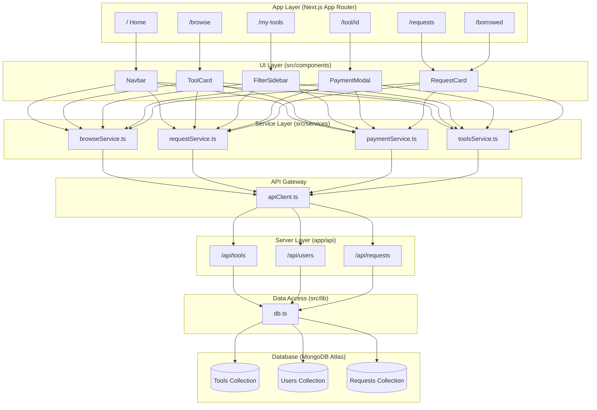
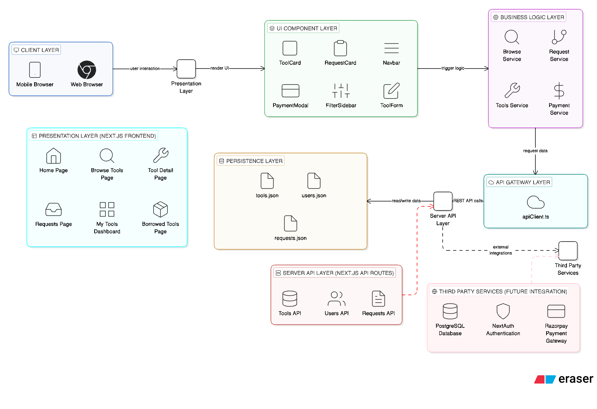

# ToolHive — Neighborhood Tool Library
### Comprehensive Project Report

---

> **Course / Subject:** Advanced Web & Software Technologies Lab (AWSTL)  
> **Project Title:** ToolHive — Neighborhood Tool Library  
> **Platform:** Web Application (Next.js 16)  
> **Report Date:** April 2026  
> **Repository:** `sapatmohit/tool-hive`
> **Version:** `v0.2.0` (Stable Backend)

---

## Table of Contents

1. [Problem Statement](#1-problem-statement)
2. [Proposed Solution](#2-proposed-solution)
3. [Project Objectives](#3-project-objectives)
4. [Technology Stack](#4-technology-stack)
5. [System Architecture](#5-system-architecture)
6. [Application Pages & Features](#6-application-pages--features)
7. [Data Models](#7-data-models)
8. [Service Layer Design](#8-service-layer-design)
9. [API Design](#9-api-design)
10. [UI Component Library](#10-ui-component-library)
11. [Payment Simulation System](#11-payment-simulation-system)
12. [Data Flow](#12-data-flow)
13. [Current Project Status](#13-current-project-status)
14. [Future Roadmap (Phase 2)](#14-future-roadmap-phase-2)
15. [Conclusion](#15-conclusion)

---

## 1. Problem Statement

Residents in urban and suburban neighborhoods frequently purchase **expensive tools for one-time or occasional use** — a power drill for hanging frames, a circular saw for a weekend deck project, or a pressure washer for seasonal cleaning. Once the project is done, these tools collect dust in garages and storage rooms.

### Core Issues Identified

| Issue | Impact |
|---|---|
| Wasteful individual purchasing of tools used once | Financial burden on individuals |
| Idle tools that neighbors could otherwise use | Resource under-utilization |
| No trusted local mechanism to share tools | Community disconnect |
| Environmental cost of manufacturing redundant tools | Increased carbon footprint |

**In short:** *The neighborhood already owns all the tools collectively; there is just no platform to make that inventory visible and accessible.*

---

## 2. Proposed Solution

**ToolHive** is a neighborhood tool-sharing web platform that connects tool owners with neighbors who need to borrow them. It functions as a **community-driven, hyper-local tool lending library**, inspired by modern marketplace platforms like Airbnb.

### How It Solves the Problem

```
Before ToolHive:  Neighbor A buys drill → uses once → collects dust
After ToolHive:   Neighbor A lists drill → Neighbor B borrows it → pays small fee
                  → Neighbor A earns, Neighbor B saves, community wins
```

### Key Value Propositions

- 🔧 **Browse** a local catalog of tools instead of buying
- 📅 **Request & Schedule** pickups with date-range selection
- 💳 **Pay securely** (simulated gateway: Card, UPI, Net Banking, Wallet)
- 📦 **List your own tools** and earn from idle inventory
- 🤝 **Build community** through trusted neighbor-to-neighbor lending

---

## 3. Project Objectives

1. Build a fully functional, production-quality web application for neighborhood tool sharing
2. Implement a clean, scalable layered architecture that can migrate from mock data to a real backend (Phase 2) without touching UI components
3. Design an intuitive, modern UI/UX inspired by leading marketplace platforms (Airbnb aesthetic)
4. Simulate a complete end-to-end user journey: browse → request → pay → borrow → return
5. Establish a reusable component library with a consistent design system

---

## 4. Technology Stack

| Layer | Technology | Version |
|---|---|---|
| **Framework** | Next.js (App Router) | 16.1.6 |
| **Language** | TypeScript | ^5 |
| **Database** | MongoDB (Atlas) | 8.x (Server) |
| **ODM** | Mongoose | ^8.10.0 |
| **Authentication** | Custom (Bcrypt + JWT simulation) | — |
| **UI Library** | React | 19.2.3 |
| **Styling** | Tailwind CSS | ^4 |
| **Icons** | React Icons (Ionicons 5) | ^5.5.0 |
| **Package Manager** | Bun | Latest |
| **Deployment** | Railway (App) + Atlas (DB) | — |

### Why These Choices?

- **Next.js 16 App Router** — Server components, file-based routing, API routes in one framework
- **TypeScript** — Strong typing across service layer, data models, and components; enables safe Phase 2 migration
- **Tailwind CSS v4** — Utility-first styling for rapid, consistent UI development
- **React Icons** — Comprehensive icon library with zero dependency overhead
- **Bun** — Faster installs and script execution versus npm

---

## 5. System Architecture

ToolHive follows a **Simplified Layered Architecture** designed for zero-friction API migration. The four layers are strictly separated and communicate only through defined interfaces.





### Architectural Rules

| Rule | Enforcement |
|---|---|
| Pages only import from `@/components/` and `@/services/` | Architecture enforced by code review |
| Components never import directly from `@/data/` | Data access only through service layer |
| No business logic in `app/` pages | All logic lives in services/components |
| Only `apiClient.ts` changes to swap to real REST API | P2 migration is a single-file change |

### Folder Structure

```
tool-hive/
├── app/                          ← Next.js App Router
│   ├── layout.tsx                — Root layout (AuthProvider + Navbar)
│   ├── page.tsx                  — Home / Landing page
│   ├── browse/page.tsx           — Tool search & browse
│   ├── tool/[id]/page.tsx        — Tool detail + booking
│   ├── my-tools/page.tsx         — Owner's tool management
│   ├── requests/page.tsx         — Incoming borrow requests
│   ├── borrowed/page.tsx         — Borrower's active borrows
│   └── api/
│       ├── tools/[id]/route.ts   — Tool CRUD API
│       ├── users/[id]/route.ts   — User CRUD API
│       └── requests/[id]/route.ts— Request CRUD API
│
├── src/
│   ├── components/               ← 17 reusable UI components
│   ├── services/                 ← 5 service files (data layer abstraction)
│   ├── models/                   — Mongoose Models (Tool, User, etc.)
│   ├── context/                  — AuthContext (Real auth integration)
│   ├── data/                     — JSON seeds (legacy/development)
│   ├── types/                    — Shared TypeScript interfaces
│   └── lib/                      — DB helpers (Mongoose wrappers)
│
├── scripts/                      — seed.ts, fix-images.ts
├── architecture.md               ← Living architecture document
└── package.json
```

---

## 6. Application Pages & Features

### 6.1 Home Page (`/`)

The landing page — a premium marketing page that showcases ToolHive's core value proposition.

**Sections:**

| Section | Description |
|---|---|
| **Hero** | Full-width hero with headline, two CTAs (Browse / List Tools), and animated floating UI cards showing a real tool listing and request status. Background glows create depth. |
| **Stats Bar** | Red accent strip: *500+ Tools Listed, 1,200+ Borrows, 50+ Neighborhoods, 4.9★ Rating* |
| **Browse by Category** | 6 clickable category tiles (Power Tools, Outdoor, Safety & Climbing, Painting, Air Tools, Construction) — each links to `/browse?category=...` |
| **Featured Tools** | Dynamic grid of up to 8 available tools fetched via `browseService`, shown with skeleton loaders while data loads |
| **How It Works** | 3-step visual explainer: Browse → Request & Schedule → Pick up & Return |
| **CTA Banner** | Dark gradient CTA encouraging tool owners to list their tools |
| **Footer** | Logo, copyright, and navigation links |

---

### 6.2 Browse Page (`/browse`)

An e-commerce-style browsing experience for discovering tools.

**Features:**
- **Persistent Filter Sidebar** (desktop) with collapsible accordion sections:
  - 📍 **Location** — Everywhere / Nearby (same city) / My State
  - 🏷️ **Category** — Dynamically loaded from tool catalog
  - 💰 **Price per day** — Min/Max numeric range inputs with visual range bar
  - ✅ **Availability** — Toggle to show only available tools
- **Mobile Filter Drawer** — Off-canvas panel for smaller screens
- **Sort Controls** — Top bar: Newest / Price: Low to High / Price: High to Low / Top Rated
- **Active Filter Chips** — Displayed pills that can be individually dismissed
- **Result Count** — Live count of tools matching current filters
- **Keyword Search** — URL-driven (`?q=`), synced with Navbar search and URL params
- **Responsive Grid** — 1 → 2 → 3 → 4 column layout

---

### 6.3 Tool Detail Page (`/tool/[id]`)

A detailed single-tool view with full booking flow.

**Features:**
- Tool image, name, category badge, location, availability status
- Owner profile card (avatar, name, rating, review count, member since)
- Rating stars and review count
- Price per day display (INR ₹)
- **Date Picker** — Start and end date selection for the borrow period
- **Total Cost Calculator** — Auto-calculated: `days × pricePerDay`
- **Borrow & Pay Button** — Triggers the PaymentModal
- Related tools section

---

### 6.4 My Tools Page (`/my-tools`)

Tool management dashboard for owners.

**Features:**
- Grid of all tools owned by the current user (mock user: `user-001`)
- **MyToolCard** component — shows tool image, name, category, price, availability toggle, edit button, delete button
- **Add New Tool** — ToolForm modal to create a new listing with fields: name, description, category, location, price, image URL, availability
- Edit and delete functionality per tool
- Empty state when no tools are listed

---

### 6.5 Requests Page (`/requests`)

Incoming borrow request management for tool owners.

**Features:**
- List of all incoming requests for tools owned by the current user
- **RequestCard** component displays:
  - Tool name + image thumbnail
  - Requester avatar, name, and rating
  - Requested date range
  - Message from the requester
  - Status badge (Pending / Approved / Rejected)
- **Approve / Reject** action buttons (calls `updateRequestStatus()`)
- Filter tabs: All / Pending / Approved / Rejected
- Empty state with illustration

---

### 6.6 Borrowed Page (`/borrowed`)

Dashboard for borrowers to track their borrow history.

**Features:**
- All borrow requests submitted by the current user
- Shows tool details, owner info, dates, and payment/status
- Status badges with color coding
- Empty state for new users

---

### 6.7 API Routes

ToolHive has a complete REST API layer built in Next.js:

| Route | Methods | Description |
|---|---|---|
| `/api/tools` | `GET`, `POST` | List all tools / create tool |
| `/api/tools/[id]` | `GET`, `PATCH`, `DELETE` | Get / update / delete a tool |
| `/api/users` | `GET`, `POST` | List all users / create user |
| `/api/users/[id]` | `GET`, `PATCH`, `DELETE` | Get / update / delete a user |
| `/api/requests` | `GET`, `POST` | List all requests / create request |
| `/api/requests/[id]` | `GET`, `PATCH`, `DELETE` | Get / update / delete a request |

---

## 7. Data Models

### 7.1 Tool

```typescript
interface Tool {
    id: string;           // e.g. "tool-001"
    name: string;         // e.g. "DeWalt Cordless Drill"
    description: string;
    category: string;     // "Power Tools" | "Outdoor" | "Construction" | etc.
    location: string;     // e.g. "Mumbai, MH"
    availability: boolean;
    ownerId: string;      // Foreign key → User
    pricePerDay: number;  // In INR (₹)
    image: string;        // Unsplash CDN URL
    rating: number;       // 0–5
    reviewCount: number;
}
```

### 7.2 User

```typescript
interface User {
    id: string;           // e.g. "user-001"
    name: string;
    avatar: string;       // Image URL
    location: string;
    rating: number;
    reviewCount: number;
    bio: string;
    memberSince: string;  // ISO date string
}
```

### 7.3 BorrowRequest

```typescript
interface BorrowRequest {
    id: string;               // e.g. "req-001"
    toolId: string;           // FK → Tool
    requesterId: string;      // FK → User (borrower)
    ownerId: string;          // FK → User (owner)
    startDate: string;        // ISO date
    endDate: string;          // ISO date
    message?: string;         // Borrower's message
    status: "pending" | "approved" | "rejected";
    createdAt: string;        // ISO timestamp

    // Joined (computed at service level)
    tool?: Tool;
    requester?: User;
    owner?: User;
}
```

### 7.4 Review

```typescript
interface Review {
    id: string;           // e.g. "rev-001"
    targetId: string;     // FK → Tool or User
    targetType: "tool" | "user";
    authorId: string;     // FK → User
    rating: number;       // 1–5
    comment: string;
    createdAt: string;
}
```

### 7.5 Notification

```typescript
interface Notification {
    id: string;
    userId: string;
    type: "request" | "message" | "system";
    title: string;
    message: string;
    link?: string;
    read: boolean;
    createdAt: string;
}
```

### 7.6 Sample Data Summary (Seeded to MongoDB)

| Entity | Count | Status |
|---|---|---|
| Tools | 15 | Active in MongoDB |
| Users | 5 | Hashed (Bcrypt) in MongoDB |
| Requests | 8 | Active in MongoDB |
| Reviews | — | Supported (Schema ready) |
| Notifications| — | Supported (Schema ready) |
| Categories | 6 | Power Tools, Outdoor, Construction, etc. |

---

## 8. Service Layer Design

The service layer is the critical abstraction between the UI and data. All five service files use `apiClient.ts` as the single integration point.

### 8.1 `apiClient.ts` — The Gateway

```typescript
// Currently calls internal Next.js API routes
export async function get<T>(endpoint: string): Promise<T>
// → fetch(`/api${endpoint}`)

export async function mutate<T>(method: string, endpoint: string, payload: any): Promise<T>
// → fetch(`/api${endpoint}`, { method, body: JSON.stringify(payload) })
```

**Phase 2 Migration:** Replace `fetch('/api...')` with `axios('https://api.toolhive.com/...')` — **zero component changes**.

---

### 8.2 `browseService.ts`

The most feature-rich service, powering the Browse page:

| Function | Description |
|---|---|
| `getAllTools()` | Fetches all 15 tools |
| `getToolById(id)` | Fetches a single tool by ID |
| `searchTools(query, filters)` | Full search+filter pipeline (see below) |
| `getCategories()` | Returns unique category list with "All" prepended |

**`searchTools` Filter Pipeline:**

```
Input: query string + filter object
  ↓ Keyword filter (name, description, category, location)
  ↓ Category filter (exact match)
  ↓ Location filter (geofencing: Nearby = same city, State = same state)
  ↓ Availability filter
  ↓ Price range filter (minPrice, maxPrice)
  ↓ Sort (price_asc, price_desc, rating)
Output: filtered & sorted Tool[]
```

---

### 8.3 `requestService.ts`

| Function | Description |
|---|---|
| `getRequestsForOwner(ownerId)` | Gets incoming requests with tool + requester data joined |
| `getBorrowedByUser(userId)` | Gets outgoing requests with tool + owner data joined |
| `updateRequestStatus(id, status)` | Approve or reject a request |
| `createRequest(data)` | Creates a new borrow request |

---

### 8.4 `toolsService.ts`

| Function | Description |
|---|---|
| `getToolsByOwner(ownerId)` | Owner's tool listing management |
| `createTool(data)` | Add a new tool listing |
| `updateTool(id, data)` | Edit an existing tool |
| `deleteTool(id)` | Remove a tool listing |

---

### 8.5 `paymentService.ts`

Full mock payment gateway simulation — see [Section 11](#11-payment-simulation-system).

---

## 9. API Design

The `app/api/` directory implements a RESTful JSON API using Next.js Route Handlers. All routes follow consistent patterns:

### Request/Response Pattern

```
GET    /api/tools        → 200: Tool[]
POST   /api/tools        → 201: Tool (created)
GET    /api/tools/[id]   → 200: Tool | 404: { error }
PATCH  /api/tools/[id]   → 200: Tool (updated) | 404: { error }
DELETE /api/tools/[id]   → 200: { message } | 404: { error }
```

Identical pattern for `/api/users` and `/api/requests`.

### Database Helper (`src/lib/db.ts`)

Abstracts database operations, enabling a seamless transition from JSON to MongoDB:

```typescript
getItems<T>(collection)           // Read all items
getItemById<T>(collection, id)    // Read single item
createItem<T>(collection, data)   // Create item
updateItem<T>(collection, id, data) // Update item
deleteItem(collection, id)        // Delete item
```

---

## 10. UI Component Library

ToolHive ships with **17 custom-built, reusable components** forming a cohesive design system.

### Design Tokens

| Token | Value |
|---|---|
| **Brand Primary** | `#FF385C` (Airbnb-inspired red) |
| **Brand Secondary** | `#E91E8C` (gradient endpoint) |
| **Border Radius** | `rounded-xl` (12px), `rounded-2xl` (16px), `rounded-3xl` (24px) |
| **Font Weight** | Semi-bold (600) to Black (900) for headers |
| **Shadow System** | `shadow-sm`, `shadow-md`, `shadow-xl` progressive hierarchy |

### Component Catalog

| Component | Variants / Props | Description |
|---|---|---|
| `Button` | primary, secondary, outline, ghost, danger — sm/md/lg | Core CTA button with hover lift animation |
| `Card` | Base shell | White rounded card with hover shadow |
| `ToolCard` | Tool prop | Listing card: image, name, location, price, rating, availability badge |
| `MyToolCard` | Tool prop | Owner-view card with edit/delete/toggle controls |
| `RequestCard` | Request prop | Request card with approve/reject actions and status badge |
| `FilterSidebar` | FilterState, categories, callbacks | Accordion sidebar with location, category, price, availability filters |
| `Navbar` | — | Sticky top navbar with logo, search, nav links, avatar |
| `SearchBar` | query, onSearch | Styled search input with submit handler |
| `Modal` | isOpen, onClose, title | Accessible overlay with Escape + backdrop dismiss |
| `PaymentModal` | tool, dates, amount, onSuccess | Full multi-method payment flow (see §11) |
| `ToolForm` | tool (optional), onSave, onCancel | Create/Edit tool form: name, desc, category, location, price, image |
| `Avatar` | src, name, size — xs/sm/md/lg/xl | Image or initials fallback avatar |
| `Badge` | 6 variants: default/success/warning/error/info/category | Status/category pill |
| `Input` | label, prefix, suffix, error | Form input with full validation display |
| `Container` | narrow (optional) | Max-width responsive wrapper (`max-w-7xl` / `max-w-3xl`) |
| `EmptyState` | icon, title, description, action | Illustrated empty placeholder |
| `Loader` | — | Animated spinner + `SkeletonCard` for loading states |

---

## 11. Payment Simulation System

ToolHive implements a **production-grade mock payment gateway** in `paymentService.ts` that simulates real-world payment behaviour.

### Supported Payment Methods

| Method | Flow |
|---|---|
| **Credit/Debit Card** | Card number (Luhn-lite validation), expiry (MM/YY), CVV |
| **UPI** | UPI ID validation (`user@bank` format), simulated bank confirm |
| **Net Banking** | Bank selection dropdown |
| **Wallet** | Wallet selection (Paytm, PhonePe, Amazon Pay, etc.) |

### Outcome Simulation

```
90% → Success (TXN generated)
 5% → Declined (bank rejection)
 5% → Failed  (gateway error)

Simulated latency: 1.5 – 3.5 seconds per method
```

### Magic Test Values (deterministic, à la Stripe Test Cards)

| Method | Value | Outcome |
|---|---|---|
| Card | `4242 4242 4242 4242` | ✅ Always success |
| Card | `4000 0000 0000 0002` | ❌ Always declined |
| UPI | `success@test` | ✅ Always success |
| UPI | `fail@test` | ❌ Always declined |
| Net Banking | SBI | ✅ Always success |
| Net Banking | PNB | ❌ Always declined |
| Wallet | Paytm | ✅ Always success |
| Wallet | Amazon Pay | ❌ Always declined |

### PaymentResult Object

```typescript
interface PaymentResult {
    status: "success" | "failed" | "declined";
    transactionId: string | null;   // e.g. "TXN-1741234567890-A3F7K2"
    message: string;
    timestamp: string;              // ISO timestamp
    amount: number;                 // Total in INR ₹
    method: PaymentMethod;
}
```

**Phase 2 Migration:** Replace `simulatePayment()` with Razorpay / Stripe SDK calls — zero UI changes required.

---

## 12. Data Flow

### Browse & Filter Flow

```
User types in SearchBar
        ↓
URL updated: /browse?q=drill&category=Power+Tools
        ↓
Browse Page reads URL params
        ↓
searchTools(query, filters) called
        ↓
apiClient.get('/tools') → /api/tools → db.ts → MongoDB (Tools Collection)
        ↓
In-memory filter pipeline runs (keyword → category → location → availability → price → sort)
        ↓
Filtered Tool[] returned → ToolCard grid rendered
```

### Borrow & Payment Flow

```
User opens Tool Detail Page
        ↓
Selects start & end dates
        ↓
Total cost calculated: days × pricePerDay
        ↓
"Borrow & Pay" button → PaymentModal opens
        ↓
User selects payment method & fills details
        ↓
simulatePayment(details, amount) called
        ↓
2–3.5 second simulated gateway latency
        ↓
PaymentResult returned:
  ✅ Success → createRequest() called → Success screen with TXN ID
  ❌ Declined → Error message displayed, retry offered
  ❌ Failed   → Network error message displayed
```

### Request Management Flow

```
Owner opens /requests
        ↓
getRequestsForOwner(ownerId)
        ↓
Parallel fetch from MongoDB: Requests + Tools + Users Collections
        ↓
Requests joined with tool & requester data
        ↓
RequestCard displayed with Approve / Reject buttons
        ↓
updateRequestStatus(id, 'approved' | 'rejected')
        ↓
apiClient.mutate → PATCH /api/requests/[id]
        ↓
UI updates optimistically
```

---

## 13. Current Project Status

### Phase 2 — Backend Integration (✅ Complete)

| Feature | Status |
|---|---|
| MongoDB Database Setup | ✅ Complete |
| Mongoose Schema Definitions | ✅ Complete |
| JSON-to-Mongo Seed Script | ✅ Complete |
| API Route Migration | ✅ Complete |
| Real Authentication (Signup) | ✅ Complete |
| Password Hashing (Bcrypt) | ✅ Complete |
| Geo-spatial Query Support | ✅ Complete |
| Service Layer Preservation | ✅ Complete (Zero UI changes) |
| Responsive design (mobile) | ✅ Complete |
| TypeScript types | ✅ Complete |
| Component library (17 components) | ✅ Complete |
| Deployment (Railway + Atlas) | ✅ Complete |

### Deployment

| Environment | URL | Status |
|---|---|---|
| Development | `localhost:3000` | ✅ Running |
| Production | Railway Cloud PaaS | ✅ Deployed |

---

## 14. Future Roadmap (Phase 2)

### Backend Integration (Final Polish)

- Replace mock payment logic with **Razorpay** or **Stripe** integration
- Implement **NextAuth.js** for robust session management
- Complete **Notification System** (WebSocket/SSE)
- Change only `apiClient.ts` for third-party integrations — zero component changes needed (by design)

### Planned New Features

| Feature | Priority |
|---|---|
| Real user authentication (NextAuth) | 🔴 High |
| User profiles & reputation system | 🔴 High |
| Real-time notifications (WebSocket) | 🟡 Medium |
| Map-based tool discovery | 🟡 Medium |
| Review & rating system | 🟡 Medium |
| Chat between borrower and owner | 🟡 Medium |
| Damage deposit / insurance options | 🟠 Low |
| Mobile app (React Native) | 🟠 Low |

### Scalability Considerations

- JSON-based data store in Phase 1 is abstracted behind API routes, making DB swap seamless
- Service layer is stateless — ready for serverless deployment
- Component library is fully decoupled — usable in a future mobile app via React Native

---

## 15. Conclusion

**ToolHive** successfully addresses the problem of wasteful, one-time tool purchasing by providing a trusted, local neighborhood tool-sharing platform. The project demonstrates:

- ✅ A **real-world, production-quality web application** built with modern best practices
- ✅ A **clean layered architecture** designed explicitly for Phase 2 API migration
- ✅ A **comprehensive feature set** covering the full borrow lifecycle (browse → request → pay → manage)
- ✅ A **premium UI/UX** inspired by leading marketplace platforms
- ✅ A **realistic payment simulation** system with multiple methods, test values, and failure scenarios
- ✅ A **fully typed codebase** in TypeScript with clear data model contracts

The platform is deployable today and structured to scale seamlessly from a mock-data prototype to a production backend — with the architectural discipline to do so without touching a single UI component.

---

*Report generated: March 2026 | ToolHive v0.1.0*
